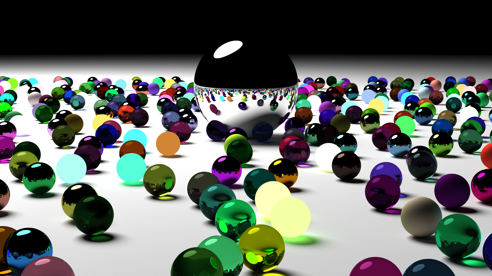

# Cuda Raytracer
A re-implementation of Peter Shirley's Ray Tracing in One Weekend and Ray Tracing: The Next Week in CUDA C++.

## Usage
### VSCode
1. Install the [C/C++ extension](https://marketplace.visualstudio.com/items?itemName=ms-vscode.cpptools).
2. Open .vscode/tasks.json and uncomment the appropriate line for your system. You will need a version of nvcc / cuda-toolkit installed.
3. Open main.cu and use the play button in the top right to build the program. The launch.json file isn't configured so it will pop up an error once the build has finished. This is fine, just ignore it. Run the executable from the command line.

### Command Line
1. Install the [CUDA Toolkit](https://developer.nvidia.com/cuda-downloads).
2. On linux, run `nvcc -o main main.cu -lX11` with libx11-dev present. On windows, run `nvcc -o main main.cu -ccbin [path to cl.exe]`.

## Features
- [x] Global illumination
- [x] Lights, transparent, matte, and metal materials
- [x] Real-time preview
- [x] .ppm output
- [ ] .png output
- [ ] Triangles and .obj support
- [ ] BVH and bounding boxes
- [ ] Better scene-creation format
- [ ] Universal materials with parameters for all properties, rather than either-or

## Screenshots
